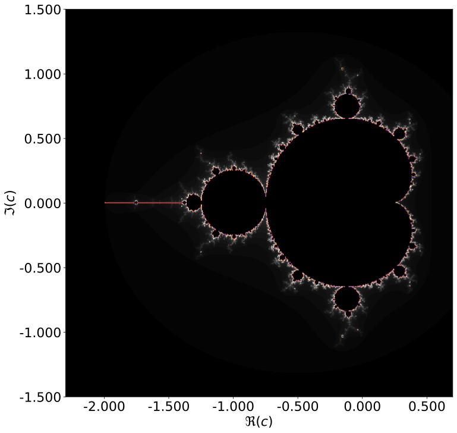

# Area of the Mandelbrot set

## Contributors:

* Paul Hosek (2753446)
* Marcel van de Lagemaat (10886699)

## Program Overview
Goal of this work is to investigate the area of the mandelbrot set using Monte Carlo Integration.
Here, pure random sampling, latin hypercube sampling and orthogonal sampling are compared.
Later, antithetic variates are used to reduce variance.
Effectiveness of all approaches is compared.

## Requirements
* Python 3.9+
* math
* numpy
* matplotlib
* numba
* scipy

### Running the code

All results are aggregated into a single Jupyter Notebook named MarcelvandeLagemaat_10886699_PaulHosek_12637033_1.ipynb.
This notebook imports all relevant files and generates the plots and data found in the report.
The authors hope this will simply review of the codebase at later points in time.

### Repository structure

| File Name           | Description                                                                                                                                                                                          |
|---------------------|------------------------------------------------------------------------------------------------------------------------------------------------------------------------------------------------------|
| gen_mandelbrot.py   | Functions related to the mandelbrot including monte-carlo integration and generating a complex grid to draw the mandelbrot on.                                                                       |
| sampling_alg.py     | Includes functions to generate points on a 2-d plane based on pure random, latin hypercube and orthogonal sampling. Further, a function converting points into their antithetic inverse is included. |
| area.py             | Compares different sampling algorithms on their convergence towards the area of the mandelbrot set. Results are saved in pickle files for further processing.    
| antithetic.py  | Functions relevant for testing the effectivness of the antithetic variates.                                                                                                                                  |
| pickle (directory)  | Stores pickle files generated to store simulation results.                                                                                                                                    |

| figures (directory) | Includes all figures generated from plotting and drawing the mandelbrot set.                                                                                                                         |

| old (directory)  | Lists files not relevant for the current version of the program.                                                                                                                                     |
